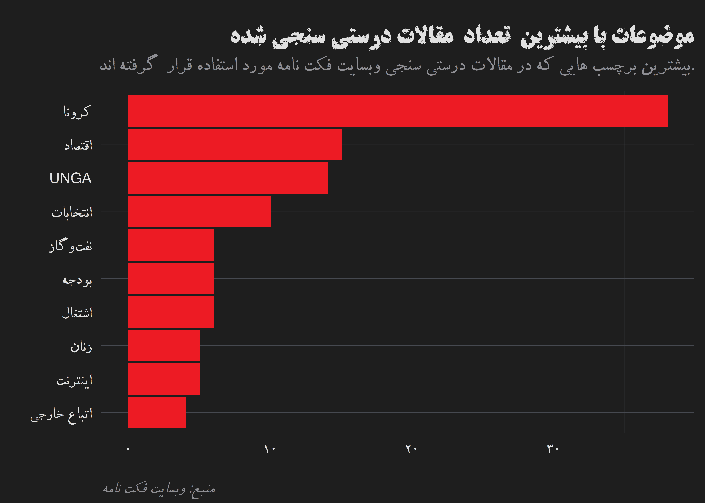

Delgosha
================

### Installation

### Basic Usage

#### Farsh theme

<!-- -->

#### Hamshahri theme

<!-- -->

There is also modern version of Hamshari’s theme which can be used by
`theme_hamshahri_modern` function.

<!-- -->

#### Digikala theme
