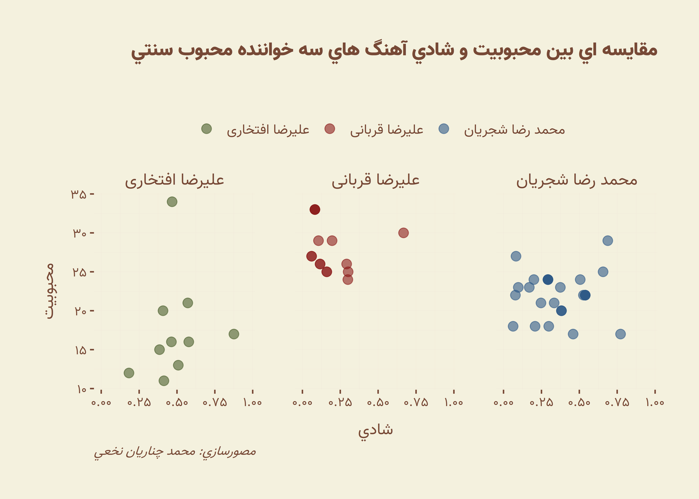
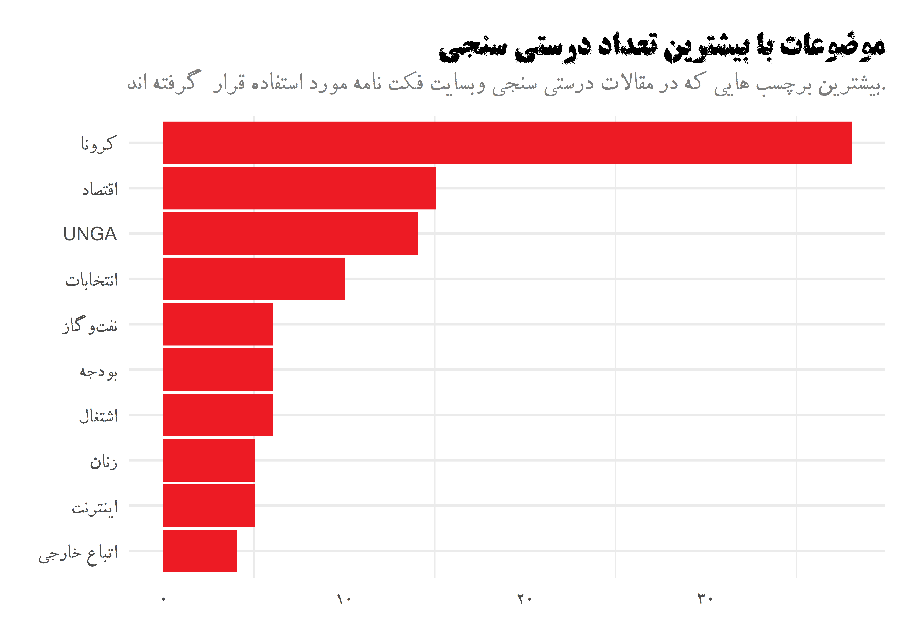
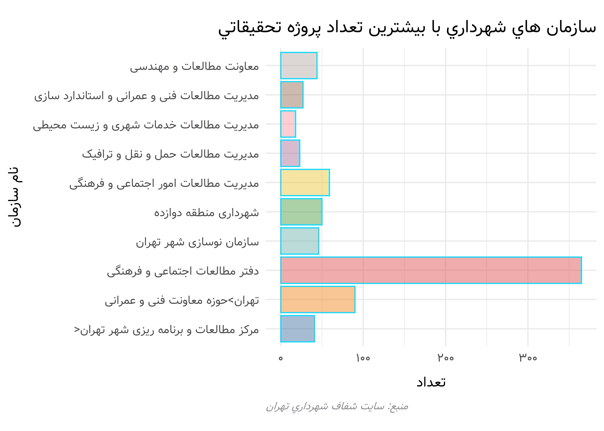

Delgosha
================

Delgosha is an opinionated package which aims to provide some ggplot2
functionality themes for RTL languages and specifically Persian.

## Installation

The package is not currently available on CRAN but you can install the
package using the following line of code:

## Usage

The package includes three types of functions:

functions that start with `theme_` change the theme of the ggplot2
visualization. At the moment the following themes are included in the
package:

functions that start with `import_` import necessary fonts for each
theme included in the package.

functions for palettes like many ggplot2 existing palettes start with
`scale_`.

### Themes

#### Farsh theme

<!-- -->

#### Hamshahri theme

Based on the main colors of Hamshahri news logo, I designed a theme for
ggplot2. Note that this theme does not necessarily represent plots shown
in Hamshahri (if such plots even exist\!).

<!-- -->

There is also modern version of Hamshari’s theme which can be used by
`theme_hamshahri_modern` function.

<!-- -->

#### Digikala theme

Based on the characteristics of plots used in their annual report I
designed the following theme. Note that probably in the original
Digikala’s plots, the IranSans font is used which requires a proprietary
license. So, I used the Yekan font in this theme.

<!-- -->

<!-- -->

### Fonts

Each theme uses a font which you might not have on your computer. If you
don’t have these fonts installed on your machine or loaded in your R
session the plots will become ugly. So, first you need to install the
fonts on your computer. you can run `import_{font_name}` functions to
find where the fonts in the package are stored and install theme. After
installing these fonts you can run `import_{font_name}` functions again
to load the fonts into your R session.

### Issues
